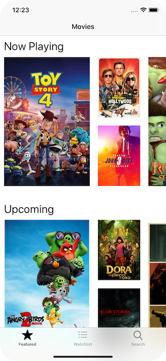
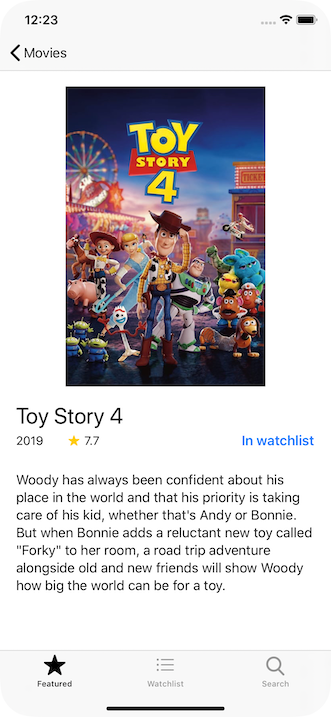
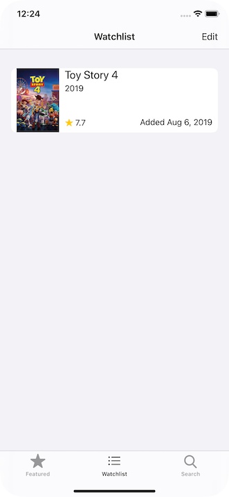
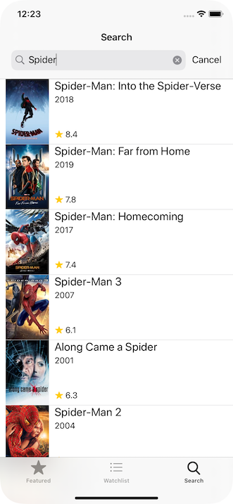

# MovieTracker
MovieTracker enables a user to browse featured movies, maintain their personal watchlist, and search the entire TheMovieDB collection of more than 475,000 movies.

&nbsp;&nbsp;&nbsp;&nbsp;&nbsp;&nbsp;&nbsp;&nbsp;&nbsp;&nbsp;
&nbsp;&nbsp;&nbsp;&nbsp;&nbsp;&nbsp;&nbsp;&nbsp;&nbsp;&nbsp;
&nbsp;&nbsp;&nbsp;&nbsp;&nbsp;&nbsp;&nbsp;&nbsp;&nbsp;&nbsp;

* I used UIKit APIs new to iOS13 (compositional layout and diffable datasource) to enable user to browse featured movies in a Netflix-style UI.

* Featured movies are displayed in a UICollectionView where each section (now playing, upcoming, trending, top-rated) is a row that itself is scrollable left-to-right.

* When a user taps on a movie, the detail page for that movie is displayed and the user is able to add that movie to their personal watchlist.

* User can also add any other movie to their watchlist by searching the full dataset of movies using UISearchController.

## My role ##
This is a solo project. I created the app from start to finish, and continue to add features.

## Technologies used
Swift, iOS frameworks (collection view, table view, compositional layout, diffable datasource, URLSession)

# Other projects
I have described a few other projects on my site: https://briandev246.github.io/projects/
